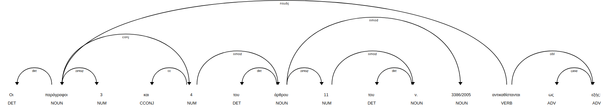

# Algorithms for analyzing Government Gazette Documents

To start with the typical structure a GG (e.g. FEK 1881) document contains articles each of which contains directions such as alterations, additions or deletions of sections such as paragraphs in other legal documents or the creation of new ones referred as “commands”. The whole GG document is signed by the competent ministers listed at the end of the documents. Then the main body of the article that has to be merged in another law or create a new law by its own.
The dataset should be split and commands should be extracted from the main bodies using named entity recognition for identifying Law IDs (defined as regular expressions) and separating commands from main bodies which are going to be altered. For example (taken from GG):

**Command**

Μετά το άρθρο 9Α του ν. 4170/2013, που προστέθηκε με το άρθρο 3 του ν. 4474/2017, προστίθεται άρθρο 9ΑΑ, ως εξής:

**Main Body**
Άρθρο 9ΑΑ 
Πεδίο εφαρμογής και προϋποθέσεις της υποχρεωτικής αυτόματης ανταλλαγής πληροφοριών όσον αφορά στην Έκθεση ανά Χώρα
1. Η Τελική Μητρική Οντότητα ενός Ομίλου Πολυεθνικής Επιχείρησης (Ομίλου ΠΕ) που έχει τη φορολογική της κατοικία στην Ελλάδα ή οποιαδήποτε άλλη Αναφέρουσα Οντότητα, σύμφωνα με το Παράρτημα ΙΙΙ Τμήμα ΙΙ, υποβάλλει την Έκθεση ανά Χώρα όσον αφορά το οικείο Φορολογικό Έτος Υποβολής Εκθέσεων εντός δώδεκα (12) μηνών από την τελευταία ημέρα του Φορολογικού 
Έτους Υποβολής Εκθέσεων του Ομίλου ΠΕ, σύμφωνα με το Παράρτημα ΙΙΙ Τμήμα ΙΙ.

Finally, a sequence of commands is generated, checked and then executed. For instance the above Command would add an article after another article in already merged law. 


## General Algorithm

### Step 1: Extracting ROIs from text and preprocessing 

Consider the following case of amendment as a paragraph:

> Οι παράγραφοι 3 και 4 του άρθρου 11 του ν. 3386/2005 αντικαθίστανται ως εξής: «3. Οι αρμόδιες υπηρεσίες για την παραλαβή των αιτήσεων των πολιτών τρίτων χωρών για χορήγηση ή ανανέωση αδειών διαμονής, εφόσον τα απαιτούμενα δικαιολογητικά είναι πλήρη, χορηγούν βεβαίωση κατάθεσης, η διάρκεια της οποίας είναι ετήσια. Η διάρκεια ισχύος των βεβαιώσεων μπορεί να μειωθεί με αιτιολογημένη απόφαση του Υπουργού Εσωτερικών, η οποία εκδίδεται μετά από εκτίμηση των δυνατοτήτων των αρμοδίων υπηρεσιών. Εφόσον η αίτηση εκκρεμεί κατά τη λήξη ισχύος της βεβαίωσης κατάθεσης, η υπηρεσία στην οποία υπεβλήθη η αίτηση υποχρεούται να εκδώσει νέα βεβαίωση κατά τα οριζόμενα στα προηγούμενα εδάφια, ενημερώνοντας ταυτοχρόνως αιτιολογημένα τον ενδιαφερόμενο σχετικά με τους λόγους καθυστέρησης. Η ίδια βεβαίωση χορηγείται, εάν πρόκειται: α) για αίτημα αρχικής χορήγησης άδειας διαμονής, όταν ελλείπει η βεβαίωση ότι έχει υποβληθεί αίτηση στον οικείο ασφαλιστικό φορέα για την κάλυψη εξόδων νοσηλείας, ιατροφαρμακευτικής περίθαλψης και εργατικού ατυχήματος ή πιστοποιητικό υγείας από Ελληνικό Κρατικό Νοσηλευτικό Ίδρυμα, όπου τα δικαιολογητικά αυτά απαιτούνται, σύμφωνα με την ισχύουσα νομοθεσία, β) για αίτημα ανανέωσης, στην περίπτωση λήξης του διαβατηρίου, εφόσον προσκομιστεί βεβαίωση της αρμόδιας προξενικής αρχής ότι έχει υποβληθεί αίτηση για την έκδοση νέου, με την επιφύλαξη της παραγράφου 1 του άρθρου και γ) για ανανέωση άδειας διαμονής για εξαρτημένη εργασία και μεταξύ των δικαιολογητικών κατατίθεται βεβαίωση εγγραφής στα μητρώα ανέργων αντί της σύμβασης εργασίας. Στις ανωτέρω περιπτώσεις, οι ενδιαφερόμενοι οφείλουν να προσκομίσουν το ελλείπον δικαιολογητικό εντός έξι μηνών από την υποβολή της σχετικής αίτησης. 4. Ο πολίτης τρίτης χώρας, ο οποίος κατέθεσε αίτηση χορήγησης ή ανανέωσης της άδειας διαμονής και έχει λάβει τη βεβαίωση της προηγούμενης παραγράφου, διαμένει νομίμως στη Χώρα, για όσο χρόνο αυτή ισχύει. Αν εκδοθεί απορριπτική απόφαση, η βεβαίωση παύει, αυτοδικαίως, να ισχύει.» 


There are two regions of interest (ROIs). The one that _signifies_ what changes and the one that signifies the _modified_ content. The _modified_ content is always enclosed in _quotes_. In this case ν. 3386/2005 is altered and paragraphs 3 and 4 are replaced with the content inside quotes. We shall call them `non_extracts` and `extracts` respectively. We follow and approach similar to [Brace Matching](https://en.wikipedia.org/wiki/Brace_matching) to get the extracts. The `extracts` list contains outer quotes (namely at depth 1) . Nested quotes are not taken into account. 

After splitting the paragraph into extracts and non-extracts, which are going to be conditionally [zipped](https://docs.python.org/3.3/library/functions.html) - i.e. each extract will match a corresponding non-extract when the amendment does not delete contents, we are going to iterate over each element `s` in `non_extracts`.

Each element `s` must be split into periods (ending with "."), avoiding _tokenization exceptions._ In our case 

> Οι παράγραφοι 3 και 4 του άρθρου 11 του ν. 3386/2005 αντικαθίστανται ως εξής: 

Should result in 

> ["Οι παράγραφοι 3 και 4 του άρθρου 11 του ν. 3386/2005 αντικαθίστανται ως εξής: "]

And `ν. 3386/2005` must not split. For this purpose, a custom _tokenizer_ has been implemented containing common tokenizer exceptions that occur in legal texts, such as ν., π.δ., ν.δ. etc. Besides this, if there are any subordinate conjunctions the corresponding sentences are stripped using the following _regular expression_:

```python
self.subordinate_conjuctions = [
            'ότι',
            'όπως',
            'πως',
            'που',
            'μήπως',
            'να',
            'όταν',
            'ενώ',
            'καθώς',
            'αφού',
            'αφότου',
            'ωσότου',
            'για να',
            'άμα',
            'εάν',
            'αν',
            'ώστε',
            'αν και',
            'μολονότι',
            'παρά'
        ]

        self.subordinate_conjuctions_regex = r', ({})[^,]*, '.format(
            '|'.join(self.subordinate_conjuctions))
```

 After tokenization, we proceed in the next step: analyzing each period. 


### Step 2: Detecting dependencies

The second part consists of detection of the dependencies so that the query will be built. This will result in a (parse) tree that will be translated into a query.  The procedure is outlined below: 


#### Step 2.1: Detection of `ROOT`

Each sentence now can be split into words. We, first iterate over each word and try to find the `ROOT`. The `ROOT` tag is a verb that signifies the _type of amendment_.  The amending actions are given from a limited set:

* Addition
* Replacement
* Deletion
* Renumbering

In our example `προστίθεται` signifies an addition. 

#### Step 2.2: Detection of subject

After the detection of the `ROOT` we must detect the subject of the amendment. In our case the subject are two paragraphs (παράγραφοι). For this purpose we use the [spaCy project](https://github.com/eellak/gsoc2018-spacy) to detect the subject that is dependent to the `ROOT`. In our case: 



We want the `nsubj` dependency (in nominative). We have detected that the dependency is in plural form and refers to paragraphs 3 and 4. So we must split the content inside the quotation marks into two subsections. For each subsection, we must detect the rest dependencies. For this purpose we have built a lookup of the _stems_: 

```python
trans_lookup = {
		'άρθρ': 'article',
		'παράγραφ': 'paragraph',
		'εδάφ': 'period',
		'φράσ': 'phrase',
		'περίπτωσ' : 'case',
		'υποπερίπτωσ' : 'subcase'
	}

```

#### Step 2.3: Detect remaining dependencies

Iterating into the sentence we detect each dependency (in accusative or in genitive) via a `re.search` on its stem.  After having each dependency detected we proceed in getting the ids of each segment. For this we will use an iterator that yields the ids, written as numbers, full-numbers etc. For example:

```python
παράγραφοι 3 και 4 => ['3', '4']
τρίτη και τέταρτη παράγραφος => ['3', '4']
παράγραφοι 3, 4 και 5 => ['3', '4', '5']
τρίτη, τέταρτη και πέμπτη παράγραφος => ['3', 4', '5']
```

After detecting the levels the process is complete and we can yield the results in JSON format:

```json
[
    {
        "what":{
            "context":"παράγραφοι",
            "content":"3. Οι αρμόδιες υπηρεσίες για την παραλαβή των αιτήσεων των πολιτών τρίτων χωρών για χορήγηση ή ανανέωση αδειών διαμονής, εφόσον τα απαιτούμενα δικαιολογητικά είναι πλήρη, χορηγούν βεβαίωση κατάθεσης, η διάρκεια της οποίας είναι ετήσια. Η διάρκεια ισχύος των βεβαιώσεων μπορεί να μειωθεί με αιτιολογημένη απόφαση του Υπουργού Εσωτερικών, η οποία εκδίδεται μετά από εκτίμηση των δυνατοτήτων των αρμοδίων υπηρεσιών. Εφόσον η αίτηση εκκρεμεί κατά τη λήξη ισχύος της βεβαίωσης κατάθεσης, η υπηρεσία στην οποία υπεβλήθη η αίτηση υποχρεούται να εκδώσει νέα βεβαίωση κατά τα οριζόμενα στα προηγούμενα εδάφια, ενημερώνοντας ταυτοχρόνως αιτιολογημένα τον ενδιαφερόμενο σχετικά με τους λόγους καθυστέρησης. Η ίδια βεβαίωση χορηγείται, εάν πρόκειται: α) για αίτημα αρχικής χορήγησης άδειας διαμονής, όταν ελλείπει η βεβαίωση ότι έχει υποβληθεί αίτηση στον οικείο ασφαλιστικό φορέα για την κάλυψη εξόδων νοσηλείας, ιατροφαρμακευτικής περίθαλψης και εργατικού ατυχήματος ή πιστοποιητικό υγείας από Ελληνικό Κρατικό Νοσηλευτικό Ίδρυμα, όπου τα δικαιολογητικά αυτά απαιτούνται, σύμφωνα με την ισχύουσα νομοθεσία, β) για αίτημα ανανέωσης, στην περίπτωση λήξης του διαβατηρίου, εφόσον προσκομιστεί βεβαίωση της αρμόδιας προξενικής αρχής ότι έχει υποβληθεί αίτηση για την έκδοση νέου, με την επιφύλαξη της παραγράφου 1 του άρθρου και γ) για ανανέωση άδειας διαμονής για εξαρτημένη εργασία και μεταξύ των δικαιολογητικών κατατίθεται βεβαίωση εγγραφής στα μητρώα ανέργων αντί της σύμβασης εργασίας. Στις ανωτέρω περιπτώσεις, οι ενδιαφερόμενοι οφείλουν να προσκομίσουν το ελλείπον δικαιολογητικό εντός έξι μηνών από την υποβολή της σχετικής αίτησης. ",
            "number":"3",
            "index":1
        },
        "article":{
            "_id":"11",
            "children":[
                "paragraph"
            ]
        },
        "paragraph":{
            "_id":"3",
            "content":"3. Οι αρμόδιες υπηρεσίες για την παραλαβή των αιτήσεων των πολιτών τρίτων χωρών για χορήγηση ή ανανέωση αδειών διαμονής, εφόσον τα απαιτούμενα δικαιολογητικά είναι πλήρη, χορηγούν βεβαίωση κατάθεσης, η διάρκεια της οποίας είναι ετήσια. Η διάρκεια ισχύος των βεβαιώσεων μπορεί να μειωθεί με αιτιολογημένη απόφαση του Υπουργού Εσωτερικών, η οποία εκδίδεται μετά από εκτίμηση των δυνατοτήτων των αρμοδίων υπηρεσιών. Εφόσον η αίτηση εκκρεμεί κατά τη λήξη ισχύος της βεβαίωσης κατάθεσης, η υπηρεσία στην οποία υπεβλήθη η αίτηση υποχρεούται να εκδώσει νέα βεβαίωση κατά τα οριζόμενα στα προηγούμενα εδάφια, ενημερώνοντας ταυτοχρόνως αιτιολογημένα τον ενδιαφερόμενο σχετικά με τους λόγους καθυστέρησης. Η ίδια βεβαίωση χορηγείται, εάν πρόκειται: α) για αίτημα αρχικής χορήγησης άδειας διαμονής, όταν ελλείπει η βεβαίωση ότι έχει υποβληθεί αίτηση στον οικείο ασφαλιστικό φορέα για την κάλυψη εξόδων νοσηλείας, ιατροφαρμακευτικής περίθαλψης και εργατικού ατυχήματος ή πιστοποιητικό υγείας από Ελληνικό Κρατικό Νοσηλευτικό Ίδρυμα, όπου τα δικαιολογητικά αυτά απαιτούνται, σύμφωνα με την ισχύουσα νομοθεσία, β) για αίτημα ανανέωσης, στην περίπτωση λήξης του διαβατηρίου, εφόσον προσκομιστεί βεβαίωση της αρμόδιας προξενικής αρχής ότι έχει υποβληθεί αίτηση για την έκδοση νέου, με την επιφύλαξη της παραγράφου 1 του άρθρου και γ) για ανανέωση άδειας διαμονής για εξαρτημένη εργασία και μεταξύ των δικαιολογητικών κατατίθεται βεβαίωση εγγραφής στα μητρώα ανέργων αντί της σύμβασης εργασίας. Στις ανωτέρω περιπτώσεις, οι ενδιαφερόμενοι οφείλουν να προσκομίσουν το ελλείπον δικαιολογητικό εντός έξι μηνών από την υποβολή της σχετικής αίτησης. ",
            "children":[

            ]
        },
        "law":{
            "_id":"ν. 3386/2005",
            "children":[
                "article"
            ]
        },
        "root":{
            "action":"αντικαθίσταται",
            "_id":11,
            "children":[
                "law"
            ]
        }
    },
    {
        "what":{
            "context":"παράγραφοι",
            "content":"4. Ο πολίτης τρίτης χώρας, ο οποίος κατέθεσε αίτηση χορήγησης ή ανανέωσης της άδειας διαμονής και έχει λάβει τη βεβαίωση της προηγούμενης παραγράφου, διαμένει νομίμως στη Χώρα, για όσο χρόνο αυτή ισχύει. Αν εκδοθεί απορριπτική απόφαση, η βεβαίωση παύει, αυτοδικαίως, να ισχύει.",
            "number":"4",
            "index":1
        },
        "article":{
            "_id":"11",
            "children":[
                "paragraph"
            ]
        },
        "paragraph":{
            "_id":"4",
            "content":"4. Ο πολίτης τρίτης χώρας, ο οποίος κατέθεσε αίτηση χορήγησης ή ανανέωσης της άδειας διαμονής και έχει λάβει τη βεβαίωση της προηγούμενης παραγράφου, διαμένει νομίμως στη Χώρα, για όσο χρόνο αυτή ισχύει. Αν εκδοθεί απορριπτική απόφαση, η βεβαίωση παύει, αυτοδικαίως, να ισχύει.",
            "children":[

            ]
        },
        "law":{
            "_id":"ν. 3386/2005",
            "children":[
                "article"
            ]
        },
        "root":{
            "action":"αντικαθίσταται",
            "_id":11,
            "children":[
                "law"
            ]
        }
    }
]
```

That is passed to the `LawParser` class, the operation is processed on the `LawParser` object and then the new object is serialized and put back to _MongoDB_. Notice that there are some special cases, i.e. operations on phrases that are more difficult to process. 


#### Testing on real examples

For more examples look at `examples/examples.md` and the `/syntax` route at the web application.


### Accuracy

The accuracy of detection reaches 89%


## Detection of deletions

### Description

There are places in the text where the mass deletion of statutes (or parts of them) are referred in order to be deleted. These varied significantly from the others so they were kept in a different category. The types of links associated with them are **απαλειπτικός** (i.e. deleting). These areas are signified with the title **Καταργούμενες Διατάξεις**. An example of this is:

>  Τα άρθρα 7, 8 και 9, 14 έως και 28, 31, 32 του ν. 1234/2018


### Step 1: Split regions of interest

The ROIs are split using regular expressions. 


### Step 2: Detect parts/levels using their stems

Same procedure as Step 2.3 above.


### Step 3: Detect child nodes and break them apart using formal grammars

After detecting the dependencies, we shall proceed detecting the child node. For this purpose we devised a formal grammar. Its description in Extended Backus-Naur Form (EBNF) follows:

<pre>

<strong>Token</strong> = 

</pre>


