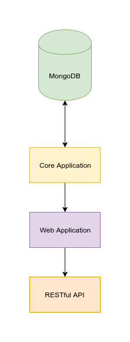
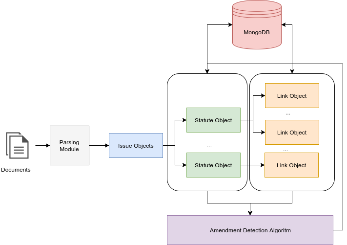
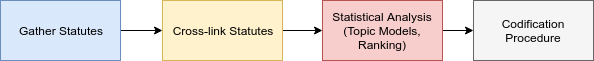
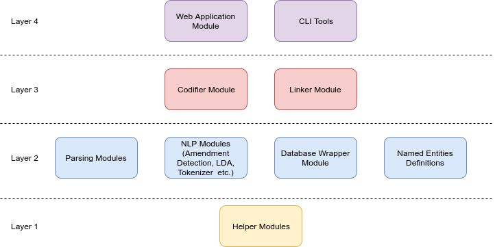

# Project Architecture

## Technologies Used

### Core

The technologies being used in the project are Python 3.x with an NLP toolkit and MongoDB as database infrastructure providing a document-based schema in which information is kept in JSON format. The communication between MongoDB and Python is done via the `pymongo` package. Finally, the `pytest` package is used for testing.

 ### Web Application

The web application that is hosted at [3gm.papachristoumarios.me](https://3gm.papachristoumarios.me) is developed using the Flask Web Micro-framework. The web application also comes with a RESTful API via which the information is accessible to via requests. 

### Building and Deployment

The building and deployment procedure is done via GNU Make in a provided Makefile under the root directory.

---

## Procedure Outline  

### General

 

The documents are being parsed by the parser and the [parser objects / issue](https://github.com/eellak/gsoc2018-3gm/blob/master/3gm/pparser.py) object are generated. After that, the issues are scanned using regular expressions for new statutes. The new statutes are placed on different [objects (statute objects)](https://github.com/eellak/gsoc2018-3gm/blob/master/3gm/pparser.py). Then the [main object (the codifier)](https://github.com/eellak/gsoc2018-3gm/blob/master/3gm/codifier.py) is responsible for cross-linking the existing issues together. Then the links and the statutes are passed to [the amendment detection algorithm](https://github.com/eellak/gsoc2018-3gm/blob/master/3gm/syntax.py) and the new versions are generated. The statutes and links are kept in a document-based database schema  (MongoDB) via serialization. The [versioning system](https://github.com/eellak/gsoc2018-3gm/blob/master/3gm/database.py) which consists of large documents is kept in GridFS. Finally there are options for checkout and rollback on existing statutes and links. 

### Pipeline

The pipelined process of codification consists of the following parts: 

1. Gather Statutes: The statutes are gathered and the objects are generated
2. Cross-link Statutes: The statutes are cross-linked
3. Statistical Analysis (optional stage): Statistical Analysis tasks such as Topic Models with LDA or PageRank are applied in order to extract useful information from the statutes and provide with more functionality such as rank-based search, similarity analysis etc. 
4. Codification Procedure: As outlined above, the codification procedure combines the statutes with their **modifying** links to create the versioning history of the statutes. 

## Source Code

### Core Modules

| Module            | Functionality                                                |
| ----------------- | ------------------------------------------------------------ |
| `pparser.py`      | Parsing documents, Creating Issues and Statute Objects       |
| `syntax.py`       | Module for amendment detection                               |
| `codifier.py`     | Module for cross-linking & codification                      |
| `app.py`          | Flask web application                                        |
| `topic_models.py` | Topic Modeling                                               |
| `tokenizer.py`    | Tokenization Module (capable of splitting sentences correctly, removing subordinate conjunctions etc.) |
| `entities.py`     | Contains entities in forms of regular expressions, Greek numbers etc. |
| `helpers.py`      | Helper functions                                             |
| `tests.py`        | Unit tests                                                   |
| `database.py`     | Database Wrapper and Versioning                              |
| `apply_links.py`  | Apply all amendments and generate history                    |

### Tools

| Tool                    | Functionality                                                |
| ----------------------- | ------------------------------------------------------------ |
| `tools/law_codifier.py` | 
CLI Tool for codification
 |
| `tools/exporter.py`     | 
Exporting Module
         |

### Architectural Pattern

The layers architectural pattern has been widely adopted by the developer community in order to build large software systems. In our project, we have followed the **layering** approach to our architecture due to its _high scalability and ease of maintenance_. The architecture diagram is shown below: 

## References

1. Spinellis, Diomidis, and Georgios Gousios. *Beautiful Architecture: Leading Thinkers Reveal the Hidden Beauty in Software Design*. " O'Reilly Media, Inc.", 2009.

 