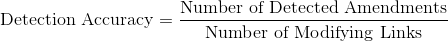
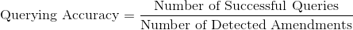

# Evaluation and Metrics

## Evaluating the Accuracy of the Algorithm

### Detection Accuracy

Consider a statute and the links that point to it (in paragraph level). We consider applying the links in chronological order. We define the _Detection Accuracy_ as:

Note that one paragraph might contain more than one amendment. We consider a detection successful iff there is at least one detection (since we do not know the number of amendments a priori). 

### Querying Accuracy

Then the number of successful queries divided by the number of amendments defines _Query Accuracy_

### Overall Accuracy

For the overall Detection / Querying Accuracy we take the mean of the individual accuracies. 

## Algorithm Evaluation

We followed a **hybrid approach** [on detecting amendments](https://github.com/eellak/gsoc2018-3gm/wiki/Algorithms-for-analyzing-Government-Gazette-Documents). This technique yielded mean detection accuracy of 85% and mean querying accuracy of 70%. The cascaded systems mean accuracy was  57%. 

### Improvements

The following improvements can be done in order to increase the accuracies:

**Detection:**

1. Add more parts-of-legal-text such as υποπαράγραφος and στοιχείο.
   **Difficulty:** Easy.
   **Workaround**: Read more texts
2. Train custom dependency analyzer. 
   **Difficulty**: Hard
   **Workaround**: Research

**Querying**

1. Clean up Government Gazette Texts
   **Dificulty**: Medium
   **Workaround**: Read more texts