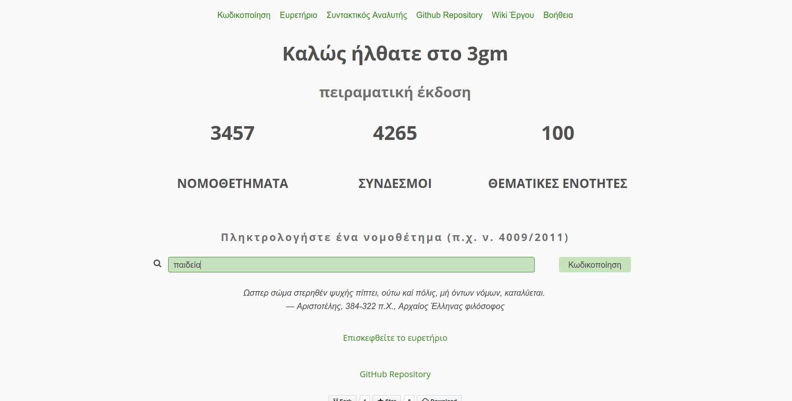
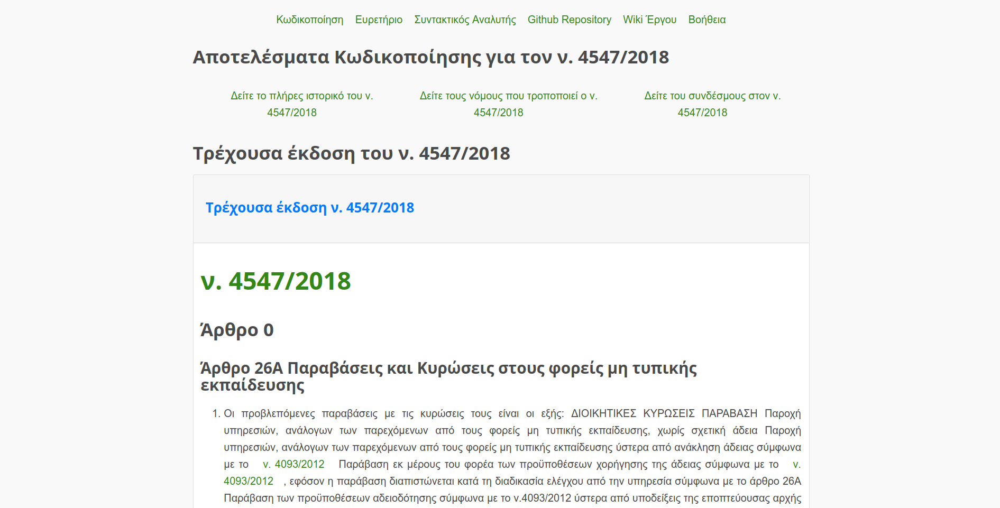
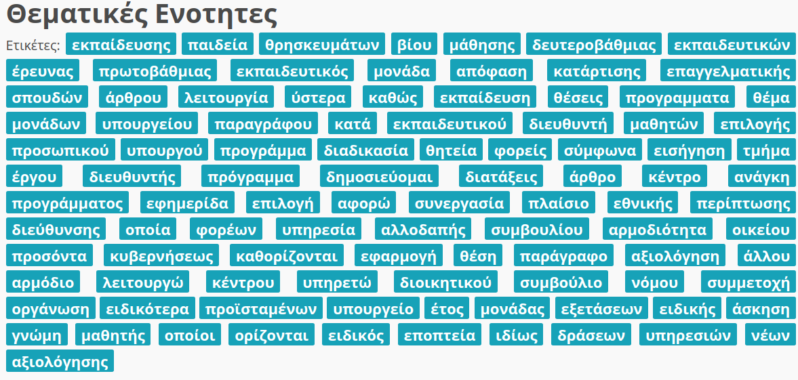
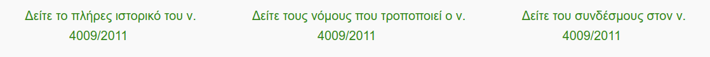
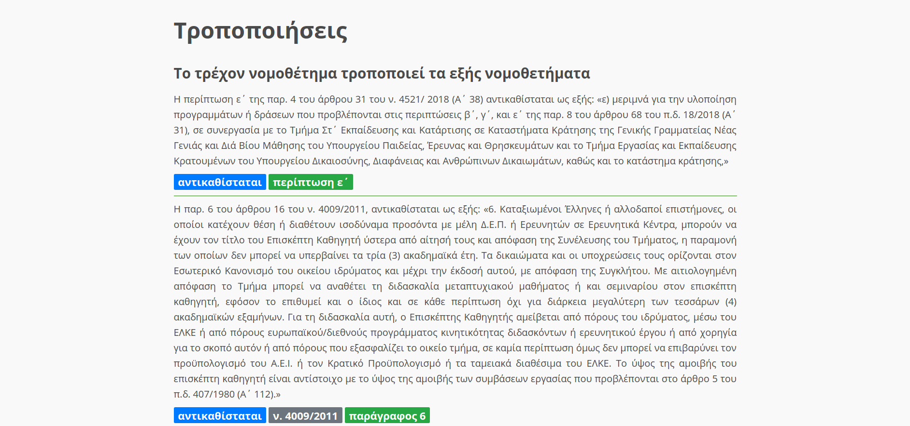

# Βοήθεια

## Πλοήγηση

1. Πληκτρολογήστε ένα νομοθέτημα (π.χ. ν. 4009/2011, ν. 4547/2018, π.δ. 1/2018) στην αρχική σελίδα ή μια θεματική ενότητα, όπως για παράδειγμα **παιδεία**.

    
   

2. Στο επόμενο παράθυρο φαίνεται η παρούσα έκδοση του νομοθετήματος, δηλαδή αυτό που ισχύει σήμερα 
   

3. Η θεματική ενότητα του νομοθετήματος εμφανίζεται από κάτω, καθώς και μια λίστα με παρόμοια νομοθετήματα.
   

4. Ακολουθώντας τους συνδέσμους μπορείτε να πλοηγηθείτε:
   

   1. Στο ιστορικό του νομοθετήματος βλέποντας όλες τις εκδόσεις του
      

   2. Στους συνδέσμους που αναφέρονται στο παρόν νομοθέτημα
      
      

   3. Στις τροποποιήσεις που επιφέρει το νομοθέτημα 

      

5. Μπορείτε να δείτε τις Διαφορές που έχουν επέλθει στο νόμο πατώντας στο σύνδεσμο "Διαφορές" στη σελίδα του ιστορικού. 

### Σχετικά με τις ετικέτες

Στην περιοχή των συνδέσμων υπάρχουν ετικέτες, όπως αυτή:

Αυτό σημαίνει ότι: 

Ο σύνδεσμος είναι **τροποποιητικός** δηλαδή τροποποιεί το προς εξέταση νομοθέτημα. Δίπλα εμφανίζεται το νομοθέτημα το οποίο τον τροποποιεί. 

Στις τροποποιήσεις του νομοθετήματος εμφανίζονται επίσης ετικέτες που αφορούν την πράξη που εκτελείται (π.χ. προσθήκη, διαγραφή, κτλ), ο νόμος που τροποποιείται καθώς και περαιτέρω στοιχεία που αφορούν π.χ. το άρθρο,  την παράγραφο, κτλ.  Για παράδειγμα:

---

# Συνεισφορά στο έργο

## Για νομικούς

Αν είσαι νομικός, είσαι πολύ χρήσιμος για εμάς. Θα θέλαμε να μας υποδείξεις:

1. Αν οι νόμοι εφαρμόζονται με τη σωστή σειρά

2. Αν υπάρχουν νομικά κείμενα που απουσιάζουν

3. Αν η θεματολογία είναι ικανοποιητική

   

## Για επιστήμονες πληροφορικής

Αν είσαι επιστήμονας πληροφορικής, είσαι πολύ χρήσιμος για εμάς. Μπορείς να συνεισφέρεις στα εξής:

1. Ανακατασκευή παλαιότερων κειμένων. Για το σκοπό αυτό μπορείς να επισκεφθείς το αντίστοιχο [έργο στο Internet Archive](https://archive.org/details/GreekGovernmentGazette)
2. Να μας βοηθήσεις με ιδέες που αφορούν αλγορίθμους Επεξεργασίας Φυσικής Γλώσσας (NLP) για να βελτιώσουμε την ανίχνευση τροποποιήσεων. 
3. Αν εντοπίσεις κάποιο πρόβλημα, ή θες να προτείνεις κάποια βελτίωση, [άνοιξε ένα issue](https://github.com/eellak/gsoc2018-3gm/issues).  
4. Αν θες να μελετήσεις τη δομή του έργου, μπορείς να δεις [τον κώδικα](https://github.com/eellak/gsoc2018-3gm) και [το wiki](https://github.com/eellak/gsoc2018-3gm/wiki)

## Για πολίτες

Η συνεισφορά σου είναι παραπάνω από χρήσιμη! Θα θέλαμε [να ακούσουμε τη γνώμη σου](#Επικοινωνία) 

## Επικοινωνία

Στείλτε μας ένα email στο [info AT ellak DOT gr](mailto:info@ellak.gr)

