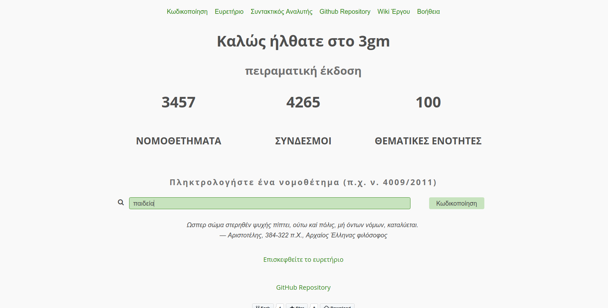
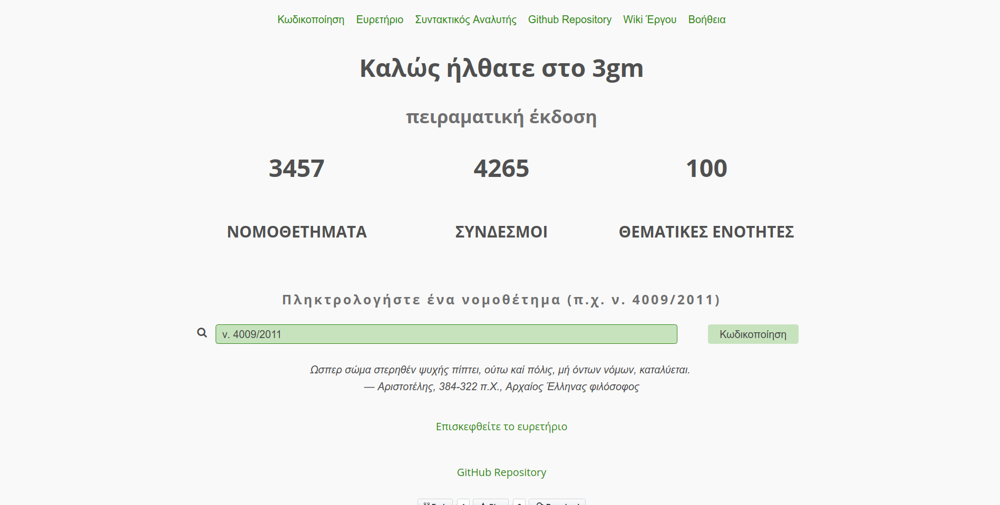
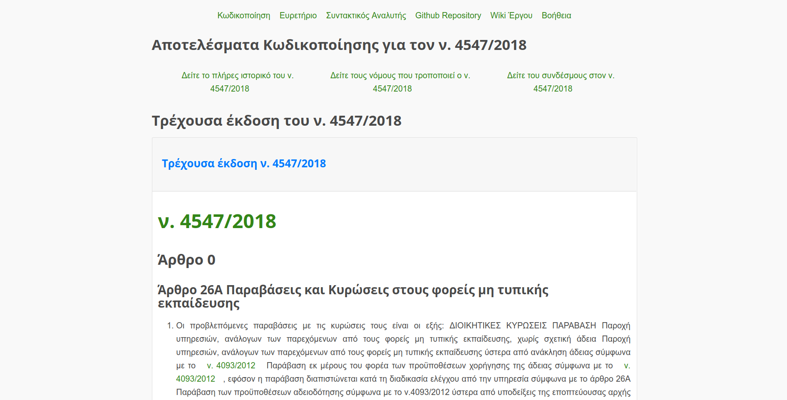
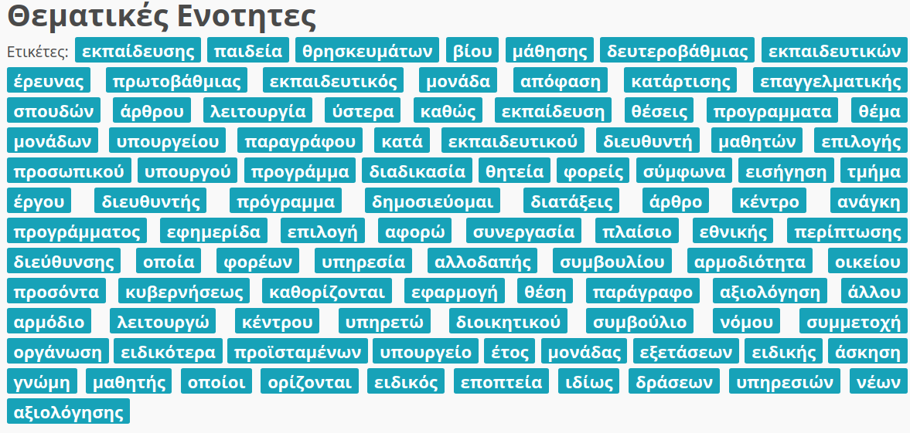
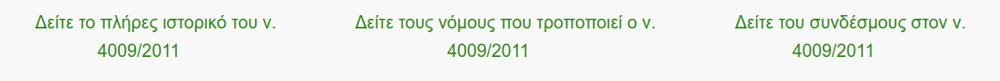
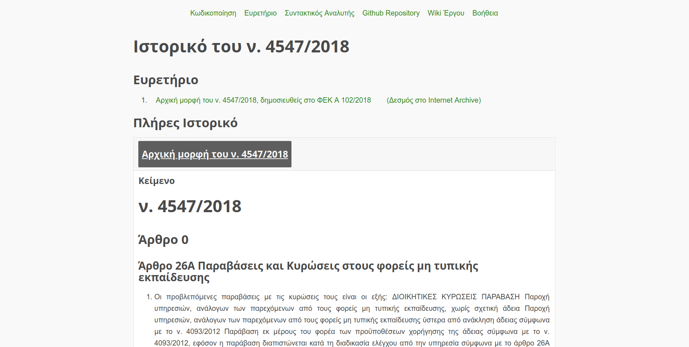
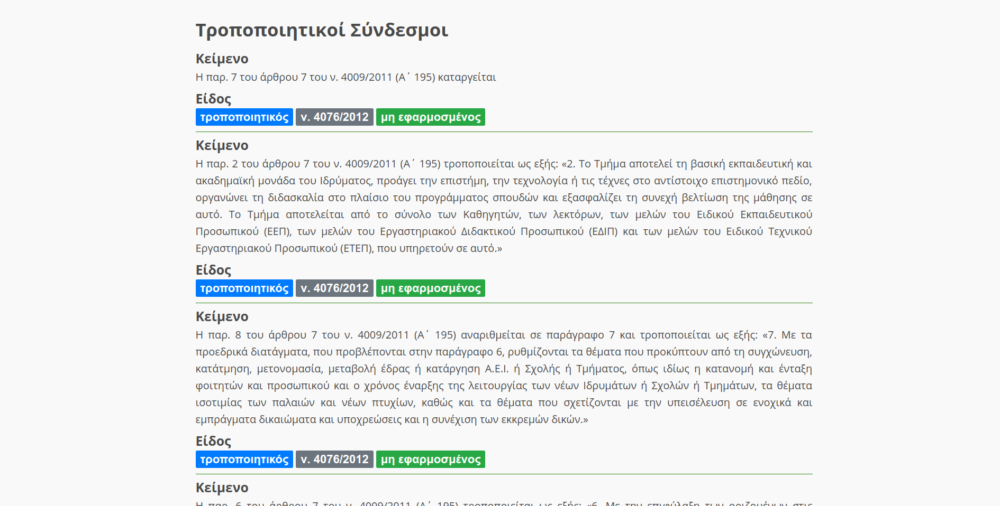
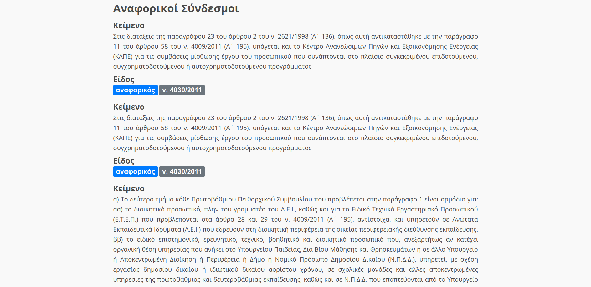
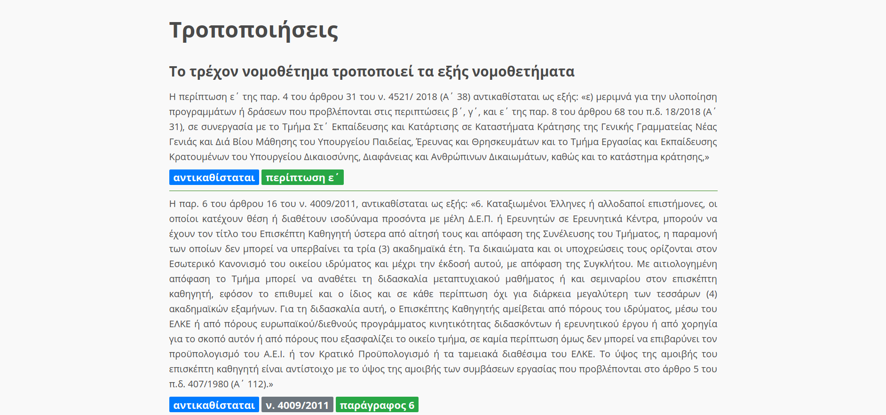

# Help (in English)

## Navigation

1. Enter a legal document (eg, ν. 4009/2011, ν. 4547/2018, π.δ. 1/2018) on the home page or a thematic section, such as **education** / **παιδεία**.

   
   

2. The following window shows the current version of the law, ie what is currently in force
   

3. The thematic section of the legislation appears below, as well as a list of similar pieces of legislation.
   

4. By following the links you can navigate:
   

   1. In the history of the legislation seeing all its editions
      

   2. The links referred to in this Act
      
      

   3. The amendments made by the law

      

### About labels

There are labels in the link area such as this:

This means that:

The link is ** modifying ** ie it amends the act to be considered. Next comes the piece of legislation that amends it.

Amendments to the legislation also show labels related to the act being executed (eg addition, deletion, etc.), the amended law as well as further details concerning, for example, article, paragraph, etc. For example:

---

# Contribution to the project

See [Contribution Page](https://github.com/eellak/gsoc2018-3gm/wiki/Contributing-To-The-Project)