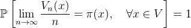
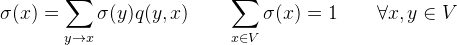
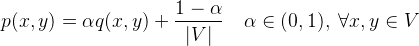

# Ranking Laws using PageRank

The process of cross-linking of legislation is an ideal case in which we can use ranking algorithms such as **PageRank** in order to rank laws and extract the significance of them.

### What is PageRank and how does it work?

Consider a web browser which selects randomly a link of a page that he is currently on and redirects there. We can imagine the surfing process as a Markov Chain on the set of pages (vertices) V in which the probability of jumping from a page x to a page y is uniform, i.e.

<p align="center">


</p>

The state space large but finite. Suppose that this chain is irreducible, so it must have an invariant distribution π. This hypothesis is equivalent to the graph being one connected component. This is not realistic as this graph would have more than one connected components, but it is an ideal reduction to showcase that the invariant distribution is a perfect significance ranking metric.  Indeed the ergodic theorem tells us that asymptotically the time we are going to spend on each page is given by its stationary distribution probability π(x). In mathematical language: 

<p align="center">



</p> 

In that sense, the invariant (or stationary) distribution is a very good **significance** measure.

We can therefore let the significance σ(x) of each page be given as:

<p align="center">



</p>

This is indeed the definition of a stationary distribution. 

How are we going to make the graph which has more than one connected components one connected component?

The idea is pretty simple. Consider tossing a coin with probability α of being heads. Therefore we can define the following transition probabilities for the set of pages V.

<p align="center">



</p>

The Markov Chain with probabilities p(x,y) will give σ(x) > 0 for all pages in the graph.

## Why is this important to rank laws? 

The cross-linked legal documents are an ideal source for this in order to detect significant laws and rank them. We used `networkx` to run PageRank on laws. Each paragraph of each law may either refer or change a law. This is very significant for the codification process as the amendments must be made on the previous laws. In our project we have classified the links for the last 20-years laws (~4500 cross-links in paragraph level) into two categories:

1. modifying (τροποποιητικός): Which are the ones who modify other laws.
2. referential (αναφορικός): Which are bare references to other laws.

It is obvious that the resulting graph is not strongly connected so the PageRank algorithm would be a perfect fit for extracting significant laws (in sense of references, modifications or both combined). 

For example, in `3gm/codifier.py` we have the following snippet for building an `nx.Graph` object and running PageRank on it:

```python
def build_graph_from_links(self):
    # build an nx graph to run pagerank	
    edges = []
    for u, link in self.links.items():
        for v in link:
            edge = (u, v['from']) # general case
            edges.append(edge)
	# add the edges
    self.graph = Graph()
    self.graph.add_edges_from(edges)
    return self.graph

def pagerank(self):
    # invoke pagerank
    self.graph = self.build_graph_from_links()
    self.ranks = pagerank(self.graph, alpha=0.9)
    return self.ranks
```

A law with greater significance is referred more often and it would be a good idea if it will be merged with others less significant ones in **semantic level**. 

