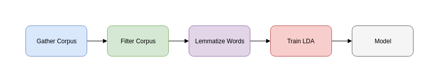

# Latent Dirichlet Allocation

LDA is an algorithm that is used to discover the topics that are in a text. **Topic modeling** is an unsupervised model for detecting topics in a corpus and categorizing similar texts. Assume that you have some documents, for example Government Gazette Documents, and you want to cluster them to similar topics, hence LDA is a perfect fit.  The algorithms work in a different way regarding their mathematics.  We are going to use `sklearn` for topic modeling and clustering to similar topics. 

In LDA, each document may be viewed as a [mixture](https://en.wikipedia.org/wiki/Mixture_model) of various topics where each document is considered to have a set of topics that are assigned to it via LDA. This is identical to [probabilistic latent semantic analysis](https://en.wikipedia.org/wiki/PLSA) (pLSA), except that in LDA the topic distribution is assumed to have a sparse [Dirichlet](https://en.wikipedia.org/wiki/Dirichlet_distribution) [prior](https://en.wikipedia.org/wiki/Prior_probability). The sparse Dirichlet priors encode the intuition that documents cover only a small set of topics and that topics use only a small set of words frequently. In practice, this results in a better disambiguation of words and a more precise assignment of documents to topics. LDA is a generalization of the [pLSA](https://en.wikipedia.org/wiki/PLSA) model, which is equivalent to LDA under a uniform Dirichlet prior distribution.

The code is located at `3gm/topic_models.py`

## Topic Modeling Procedure

The proposed way of modeling the topics is:

1. Parse raw texts
2. Remove punctuation numbers
3. Filter out words considered "junk" (i.e. really small words)
4. Lemmatize everything using Greek Lemmatizer provided from this GSoC project [which adds the Greek Language to spaCy](https://github.com/eellak/gsoc2018-spacy) and lookup provided at `resources/greek_lemmas.py`.   
5. Run LDA to extract topics (optionally using grid search) to find the best parameters
6. Gather topics to a graph.
7. Store to MongoDB collection.

The pipeline is illustrated below:



We can further our work by searching for connected components in the graph using a graph search algorithm such as Breadth-First Search. 

A visualization of topic models can be done using the `pyLDAvis` library. The interactive Jupyter Notebook can be found at `src/lda_visualize.ipynb` . Some example LDA models are located in the `models` directory. 

## Building Topic Models from the `codifier`

The `topic_models.py` module populates everything from the database. Invoking it via
```
python3 topic_models.py
```
would build the topics for your codifier corpus. You can adjust the parameters `n_components` and `no_top_words` to see how the model performs, as well as the bounds for the Greek stoplist and the Government Gazette stoplist. 
Then it builds the `topics` collection to the MongoDB database: 

For example the query 
```
{'statutes' : 'ν. 4009/2011'}
```
yields the following topic
```json
{
    "_id":79,
    "statutes":[
        "π.δ. 14/2017",
        "ν. 4009/2011",
        "ν. 3848/2010",
        "ν. 4473/2017",
        "ν. 4415/2016",
        "ν. 4115/2013",
        "π.δ. 47/2006",
        "ν. 3467/2006",
        "ν. 4395/2016",
        "ν. 3413/2005",
        "π.δ. 96/2012",
        "ν. 3685/2008",
        "π.δ. 28/2014",
        "ν. 4386/2016",
        "ν. 4283/2014",
        "π.δ. 78/2016",
        "π.δ. 9/2006",
        "π.δ. 173/2008",
        "π.δ. 155/2007",
        "ν. 4485/2017",
        "ν. 3748/2009",
        "ν. 4476/2017",
        "ν. 4452/2017",
        "ν. 4310/2014",
        "π.δ. 252/2005",
        "ν. 3794/2009",
        "π.δ. 41/2011",
        "π.δ. 89/2015",
        "π.δ. 54/2012"
    ],
    "keywords":[
        "παιδείας",
        "θρησκευμάτων",
        "εκπαίδευσης",
        "έρευνας",
        "πολιτισμού",
        "διευθυντής",
        "αθλητισμού",
        "σπουδών",
        "ιδρύματος",
        "αθλητής",
        "τομέα",
        "εκπαιδευτικοί",
        "σχόλη",
        "μάθησης",
        "βίου",
        "συμβούλιο",
        "ακαδημαϊκά",
        "διευθυντή",
        "διδακτά",
        "προγράμματος",
        "καθηγητής",
        "βαθμίδα",
        "ινστιτούτο",
        "σχολής",
        "υπουργού",
        "συμβουλίου",
        "φοιτητής",
        "προσωπικού",
        "εφημερίδα",
        "υπουργείου",
        "κυβερνήσεως",
        "δι",
        "τμήματος",
        "οργανισμό",
        "εθνικής",
        "οργανισμού",
        "έρευνα",
        "σχολή",
        "αλλοδαπή",
        "κριτήρια",
        "συγκρότηση",
        "τεχνολογία",
        "προσόντα",
        "ημεδαπά",
        "κέντρου",
        "τεχνολογίας",
        "διεύθυνση",
        "κατ",
        "πιστοποίηση",
        "ερευνών",
        "τόμε",
        "κατάρτισης",
        "υπουργό",
        "προσόντων",
        "διεθνές",
        "σχολές",
        "υποψηφίων",
        "εξέλιξη",
        "αναγνωρισμένος",
        "γνώστης",
        "πανεπιστημίου",
        "κατεύθυνση",
        "υπουργών",
        "γραφείο",
        "τμημάτων",
        "δίπλωμα",
        "εισαγωγή",
        "ίδρυση",
        "ειδικού",
        "υποψήφιος",
        "διεξαγωγή",
        "προγραμμάτων",
        "ολοκλήρωση",
        "εξωτερικά",
        "οργανισμός",
        "αμοιβή",
        "κατανομή",
        "τοποθέτηση",
        "ποιότητα",
        "εξαίρεση",
        "εδες",
        "απόσπαση",
        "διατάξεις",
        "εθνικό",
        "νοούμαι",
        "απασχόληση",
        "παρ",
        "στέλεχος",
        "σκόπια",
        "κυκλικά",
        "εξάμηνο",
        "γλώσσας",
        "εκπόνηση",
        "εργαστηρίων",
        "αξιοποίηση",
        "πίνακες",
        "καθήκοντα",
        "ακολούθως",
        "συμμετέχω",
        "εποπτεύω"
    ]
} 
```

## Invoking spaCy lemmatizer for the Greek Language

For further improving the lemmatization process for topic extraction we are also using the spaCy's lemmatizer for the Greek Language via the `word._lemma` attribute.

In case you want to invoke spaCy's lemmatizer along with the lookup, you can do this by running:

```bash
python3 topic_models.py --spacy    
```

## References

1. [Medium Article](https://medium.com/mlreview/topic-modeling-with-scikit-learn-e80d33668730)
2. [sklearn Reference Manual](http://scikit-learn.org/stable/modules/generated/sklearn.decomposition.LatentDirichletAllocation.html)
3. Blei, David M., Andrew Y. Ng, and Michael I. Jordan. "Latent dirichlet allocation." *Journal of machine Learning research* 3.Jan (2003): 993-1022.
4. [Latent Dirichlet Allocation](https://en.wikipedia.org/wiki/Latent_Dirichlet_allocation)

